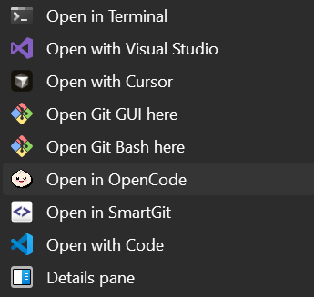

# OpenCodeContextMenu

Windows context menu installer for OpenCode.



## Install
```powershell
powershell -ExecutionPolicy Bypass -Command "irm https://raw.githubusercontent.com/bariskisir/OpenCodeContextMenu/master/install.ps1 | iex"
```

## Uninstall
```powershell
powershell -ExecutionPolicy Bypass -Command "irm https://raw.githubusercontent.com/bariskisir/OpenCodeContextMenu/master/uninstall.ps1 | iex"
```
